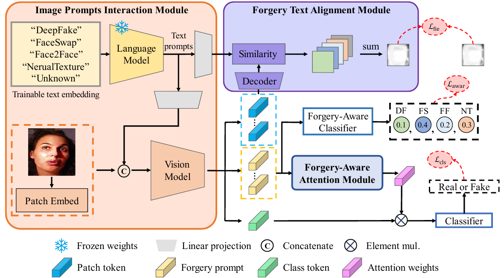

<h2 align="center">
Official Implementation of "Refining Forgery-Aware Prompts for Deepfake Detection with Pattern Blended Samples"
</h2>

<center>
<div style="background-color: white; display: table;">
  
</div>
</center>

- Forgery-Aware Prompts Learning (FAPL) based deepfake detection framework, which extracts the information of diverse forgery patterns by the forgery prompts and fuses the information of each forgery pattern to generate adaptive attention weights for the final decision. 

- Multivariate-and-Soft-Blending (MSB) based data augmentation method for the proposed FAPL framework. It provides diverse data annotation and drives our FAPL framework to deal with the complicated forgery patterns, which is unknown in existing training dataset and helpful in refining the forgery prompts. 

## ⚒️ Project Structure

```bash
FAPL_code/
├── training/            # For FAPL training 
│   ├── CLIP/            # Oringinal CLIP implementations 
│   ├── CLIP_Model.py    # Implementations of FAPL framework
│   ├── FFPP_Dataset.py  # Dataloader of FF++, which contains MSB augmentation
│   ├── flops.py         # Compute the inference metrics
│   ├── metric_util.py   # Compute the performance metrics of detection
│   ├── mffi_test.py     # Test entry for MFFI
│   ├── test_loader.py   # Dataloader for test sets
│   ├── test.py          # Test entry
│   └── train.py         # Training entry
├── mnn_inference/       # For FAPL deployment
│   ├── convert/         # Convert model format (Pytorch -> MNN)
│   ├── imgs/            # test samples
│   ├── mnn_model/       # Place of the MNN file
│   ├── dataset_infer.py # Dataset inference entry
│   └── img_infer.py     # Single image inference entry
├── fig/                 # Figure
└── README.md            # Project introduction
```

## 🤖 Pre-trained Weights

In this link [[Baidu Disk](https://pan.baidu.com/s/11Ci0L7VbOSlpanLdGUDcDA?pwd=8g4q)], we provide two versions of the pre-trained weights for FAPL:

1. `FAPL.pth` (550MB): Trained from CLIP ViT-Base (PyTorch).
2. `FAPL_detector.mnn` (124MB): Int8 quantified model converted from `FAPL.pth` using the [MNN](https://github.com/alibaba/MNN/tree/master) (Mobile Neural Network) framework. This version is recommended for inference and experimenting with FAPL.

## 💪 Training

- The core code for training FAPL is located in the `training` folder.
    - `train.py` implements the entire training stage.
    - `test.py` runs the evaluation process on different datasets.
    - `FFPP_Dataset.py` implements the whole data pipeline during training.
    - The MSB process is also implemented in the `Multiple_Soft_Blend` function within `FFPP_Dataset.py`.

- For different datasets, you need to download and preprocess them according to their official websites and the instructions in the [Deepfake Benchmark](https://github.com/SCLBD/DeepfakeBench). Afterwards, update the corresponding file paths in `test_loader.py` (for other datasets). For [DF40](https://github.com/YZY-stack/DF40), you need to using the official test data and code provided on their website. 

## 🔬 Deployment & Inference

For a quick start (CPU only), follow these steps:

1. Create a virtual environment and install MNN:
    ```bash
    pip install MNN
    ```
2. Place the MNN model file in `./mnn_inference/mnn_model` and specify the image file to be detected in `img_infer.py`. A pair of real/fake images are provided in the `./mnn_inference/imgs` folder for a quick test.
3. Run `img_infer.py`:
    ```bash
    python img_infer.py
    ```
4. Output interpretation:
    - (float) probability of being fake.
